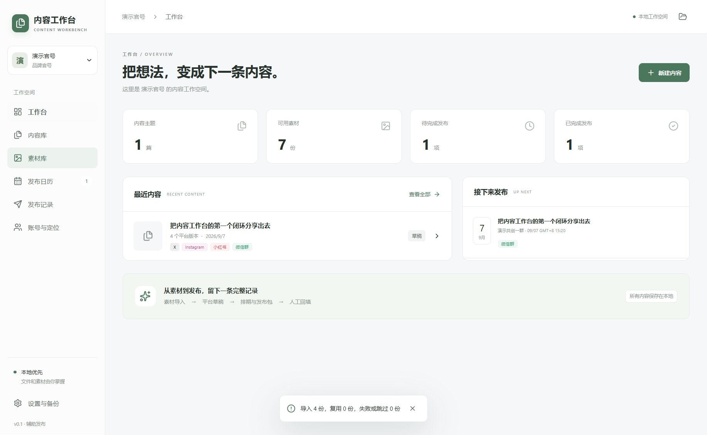

# 内容工作台 · Content Workbench

一个本地优先的 Windows 桌面内容工作台：按品牌官号、创始人 IP 分项目，管理图片和视频，用本机 Codex 起草平台版本，再完成排期、发布包导出和人工结果记录。

Electron 44 + React 19 + TypeScript + SQLite。业务项目是普通文件夹，不要求 Git，也不搬走原素材。此仓库管理应用源码，不保存运营账号凭据或真实业务数据。

## 本地私密文件放在哪里

密钥、平台登录凭据、私有配置和业务备份统一放在仓库下的 `local-private/`。该目录整体被 Git 忽略，不会随正常的 `git add`、提交和推送上传到 GitHub。它只在本机创建，GitHub 下载包中没有这个文件夹；其他电脑的创建方法及完整清单见 [本地私密文件与 Git 忽略规则](docs/local-private-files.md)。Codex 继续使用本机 CLI 登录，无需复制登录凭据。

## 怎么启动软件

### dev 分支开发启动

在本仓库目录运行：

```powershell
git switch dev
npm run dev
```

首次获取源码时先运行 `npm ci`。`npm run dev` 会编译源码、启动本地 Vite 服务并打开 Electron 窗口，同时连接本机已登录的 Codex CLI。终端出现 `[dev] Codex ready` 表示连接成功；若未登录或路径不可用，可在软件设置中修正后重连。

开发服务地址为 `http://127.0.0.1:5173`，完整功能通过 Electron 窗口使用。保留运行中的终端即可持续开发，关闭应用窗口会结束开发服务。此命令不生成安装包，`dev` 分支的 GitHub 检查也跳过安装包构建。

当前 `dev` 版默认使用浅色主题，可在“设置与备份 → 外观”切换。平台可在“账号与定位 → 平台管理”中新增或编辑；默认包含微信公众号。内容编辑会根据平台使用帖子、图文笔记、长文章、消息、横屏视频、短视频或图片动态的界面。操作方法见 [平台与外观设置](docs/platform-editors.md)。这些更新通过 `npm run dev` 体验，之前的安装包不包含本次开发改动。

在版本编辑器顶部的“发布类型”中，还可以选择 YouTube 视频 / Shorts、B站投稿 / 动态、抖音视频 / 图文、Instagram 轮播 / Reel / Story、Facebook 图文 / 链接 / Reel、Discord 频道 / 论坛、微信群消息 / 公告。对应的平台字段、媒体预览和发布包会一起变化；切换类型保留原有文案与素材。消息支持按空行拆分和逐段复制。

### 已有本次本地交付文件（推荐）

打开本次交付目录，双击上一级的 `启动内容工作台.cmd`，脚本会进入旁边的 `content-workbench` 目录并运行 `npm run dev`，启动当前源码的开发版。需要 Node.js 22.18 或更高版本及 npm；首次使用请先在仓库目录运行 `npm ci`。运行期间保留终端窗口，关闭软件后开发服务会退出。若提示 5173 端口被占用，请先关闭已运行的开发版再重试。

若要打开之前的打包版本，可直接双击 `release/0.1.1/win-unpacked/Content Workbench.exe`；该方式无需 Node.js，但不包含最新开发改动。请保留完整的 `win-unpacked` 文件夹。启动脚本和演示项目属于本地交付文件，不包含在 GitHub 源码下载包中。

### 使用 Windows 安装包或便携包

| 文件 | 启动方法 |
|---|---|
| `Content-Workbench-Setup-0.1.1-x64.exe` | 双击安装，选择安装目录；完成后通过快捷方式打开 Content Workbench |
| `Content-Workbench-Portable-0.1.1-x64.exe` | 双击后等待解压和窗口出现；需要临时目录有足够空间 |
| `win-unpacked/Content Workbench.exe` | 直接双击；整个 `win-unpacked` 文件夹必须保持完整 |

本版本产物位于 `release/0.1.1/`。仓库管理源码，源码 ZIP 不含现成的安装包；可在成功的 [Desktop checks 工作流](https://github.com/YuqingZayn/content-workbench/actions) 中查看构建附件，或按下文自行构建。

本次构建未配置代码签名证书。如果便携版因临时目录空间不足无法启动，可运行已解压应用，或将安装版安装到空间充足的磁盘。

### 从源码启动（仅开发时使用）

需要 Windows x64、Node.js 22.18 或更高版本及 npm。**先在终端进入这个 README 所在的 `content-workbench` 目录，再执行命令。** 首次安装依赖需要网络，会获取 Electron 运行时。

```powershell
npm ci
npm run dev
```

`npm run dev` 会构建代码并打开 Electron 窗口。开发期间保留终端；依赖已安装且锁文件未变化时，下次可直接运行 `npm run dev`。如果报错找不到 `package.json`，请检查当前目录；如果提示找不到 `npm`，请检查 Node.js 安装，或直接使用打包后的应用。

## 软件打开后，先做什么

1. 在欢迎页点击“打开本地文件夹”。
2. 本次本地交付可选择上一级 `演示项目/演示官号` 或 `演示项目/演示创始人`；从 GitHub 获取源码的使用者可新建自己的空文件夹。
3. 在“账号与定位”填写项目身份、发送账号和目标；在“素材库”导入图片或视频，在“内容库”创建主题和独立平台版本。
4. 编辑后点击“保存草稿”。需要 AI 时，再按下一节连接 Codex。

业务项目请选择自己的运营资料目录，每个身份一个文件夹。演示数据的发布结果标注为验收模拟，没有真实发送。

## 连接 Codex（AI 起草时使用）

先在本机安装并登录 Codex CLI，再点击右侧“连接本机 Codex”。如果提示找不到 CLI，在“设置与备份”中选择实际的 `codex.exe`。打开内容主题后，在右侧输入需求。

当前 dev 版内置 Codex 默认开启 **Full Access（完全访问）**，可以读取、创建和修改本机当前账号可访问的文件（包括项目外目录）、运行命令和联网。右侧“任务方式”默认是“执行任务”，可直接要求修改文件或软件代码；不需要先创建平台版本。选择“起草版本”或点击文案快捷动作时，结果仍会经过校验写回所选版本。两种方式都使用完全访问权限。

新建与恢复会话均使用 `danger-full-access` + `approvalPolicy: never`，任务执行前核对 CLI 返回的实际权限。本设置只作用于软件发起的 Codex 会话，不修改全局 Codex 配置；也不会自动获得 Windows 管理员权限。操作示例和验证方法见 [Codex 完全访问](docs/codex-full-access.md)。

AI 生成需要网络和可用额度。手动编辑、素材管理、排期、导出和回填不依赖 Codex 登录。当前协议验证基于 CLI 0.153.3；不读取 Codex 内部数据库或复制登录凭据。



## 检查与打包

```powershell
npm run typecheck
npm run lint
npm test
npm run test:integration
npm run test:e2e
npm run dist:win
```

`release/` 输出安装版和便携版；默认测试不会发送社交平台内容。`npm run verify:codex` 会使用本机已登录的 Codex 运行真实演示生成，需要单独显式执行，结果保存在忽略的 `.local/` 中。

## 第一个闭环

1. 打开两个本地文件夹，分别设置官号和创始人身份资料。
2. 导入图片和 MP4，支持复制、外部引用、重复识别、视频拖动、关键帧和裁剪副本。
3. 创建内容主题，添加独立的平台 / 语言版本，编辑或让 Codex 按当前身份起草。
4. 保存并标记就绪，选择账号和群 / 频道等目标，安排人工截止时间。
5. 每个目标独立导出固定文案和有序媒体，再回填实际发送人、时间、结果和已发送段落。
6. 重启后保持项目、草稿、媒体顺序和逐目标状态。恢复备份后，未完成任务默认暂停。

内置平台：X、Discord、YouTube、Facebook、B站、抖音、小红书、Instagram、微信群、微信公众号，并支持新增自定义平台。当前均为辅助发布，实际平台发送由用户执行。

## 文档

- [使用指南](docs/user-guide.md)
- [平台编辑界面与外观设置（dev）](docs/platform-editors.md)
- [0.1.1 图片加载优化与 GitHub 参考](docs/image-performance.md)
- [实现与验证记录](docs/verification.md)
- [实际平台能力](docs/platform-capabilities.md)
- [架构与数据边界](docs/architecture.md)
- [任务进度与后续工作](docs/roadmap.md)
- [依赖与来源](docs/third-party-notices.md)

业务文件以 UTF-8 Markdown / JSON 保存，SQLite 保存任务、回执和会话映射。打开源码目录作为业务项目之前请确认用途；日常运营应使用单独的文件夹。

本仓库公开可见，当前未授予额外开源许可。
