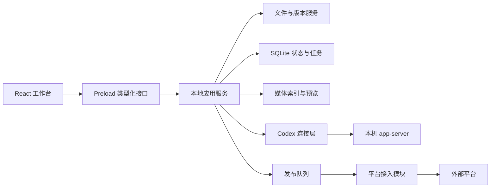

# 账号项目内容工作台：产品与技术实施方案

规格版本：1.0；日期：2026-09-07；状态：可进入开发。本文使用“必须”表示版本验收项，“建议”表示可替换的实现细节。与历史方案冲突时，以用户最新要求和本文为准。

## 1. 目标、范围与版本

### 1.1 核心目标

把官号和创始人 IP 的日常内容工作集中在本地桌面：打开文件夹，管理图片和视频，让本机 Codex 协助生成平台版本，完成排期、发布准备和结果记录。

产品层级：**账号项目 → 平台账号 → 发布目标**。内容属于账号项目；内容主题下有多个语言／平台版本；发布任务同时绑定具体版本、平台账号和目标位置。

### 1.2 首版默认条件

| 项目 | 决定 |
|---|---|
| 用户 | 一人或小团队内部运营，单机单写入者 |
| 平台 | Windows 10/11 x64 优先；其他系统保留架构扩展空间 |
| 数据 | 本地文件为正文与素材来源，SQLite 保存状态和任务 |
| 项目 | 普通文件夹，不要求 Git；官号与创始人 IP 独立 |
| 语言 | 界面中文；内容支持至少简体中文和英文 |
| 网络 | 离线可编辑和预览；远程模型、授权、发布需要联网 |
| 排期 | 本地任务依赖电脑运行；平台原生定时只有实测后启用 |
| 开发栈 | Electron＋React＋TypeScript，SQLite，应用服务封装文件与发布操作 |
| Codex | 本机 CLI；已检测到 0.153.3，不宣称已完成真实连接验证 |

### 1.3 版本边界

| 版本 | 必须交付 | 允许的外部依赖边界 |
|---|---|---|
| v0.1 本地内容闭环 | 项目、身份资料、媒体、编辑、Codex、平台版本、日历、发布包、人工回填、备份 | Codex 未登录时仍可使用全部手动功能；九个平台无凭据即可登记和准备内容 |
| v0.2 自动发布 | 统一接入接口、Discord、X、IG、Facebook Page 的已获授权能力，队列及回执恢复 | 每个平台单独通过实际验证后启用；未具备条件的平台保留辅助模式 |
| v0.3 运营增强 | 抖音等条件接入、更多视频发布、指标回收、可选转录、模板复用 | 按实际业务频率排序，不阻塞前两版 |

首版不包含完整视频剪辑器、自动私信／评论、普通微信群无人值守发送、跨设备同步、多人同时编辑同一项目、SaaS 计费。视频播放和管理必须在 v0.1，视频自动发布能力另行验证。

## 2. 核心用户流程

### F01 打开已有账号项目

1. 点击“打开本地文件夹”，系统原生选择目录。
2. 已有本应用元数据则读取；否则创建 `.content-workspace/`，使用目录名作为可修改的项目名，身份类型默认“品牌官号”。
3. 索引允许的媒体和文档，显示进度；不移动、不删除原文件。默认跳过 `.git`、`node_modules`、构建输出、本应用缓存和隐藏凭据目录。
4. 首页展示最近内容、待发布任务、可用素材和账号连接状态。没绑定平台时仍可使用。
5. 路径不存在时保留最近项目卡片，并提供“重新定位”；只读目录提供浏览模式。

新建项目复用该流程，但先创建用户指定的空目录和模板。已有同名文件不覆盖。项目身份可随时改名，稳定 projectId 不改变。

### F02 官号与创始人 IP 切换

项目卡片显示头像／图标、名称、身份类型、路径和运行中任务数。切换后内容、素材、日历和 Codex 会话切换到对应项目。已运行任务持有原 projectId 和目录，不跟随界面切换。状态提示能跳回任务所属项目。

平台账号默认只归属一个账号项目；同一外部账号在不同项目重复绑定时显示已有归属，禁止静默复制授权。跨项目复用内容通过“复制到项目”，创建新内容 ID，并选择是否复制素材，不复用对话和发布任务。

### F03 导入并预览素材

拖入文件／文件夹、选择文件、粘贴截图 → 选择复制或外部引用 → 后台索引 → 生成缩略图／视频封面 → 加标签或关联内容。

默认复制，原文件保留；用户可对大视频选择引用。重复文件根据内容哈希提示复用已有素材；不同项目不自动去重共享。复制先写临时文件，成功校验后入库；失败可重试，不出现可用状态的半文件。

### F04 创建并改编内容

新建主题 → 填目标受众、目标行动、事实底稿 → 选素材 → 添加平台及语言版本 → 编辑或调用 Codex → 预览、校对 → 保存为可发布版本。

底稿是可选的组织工具，用户也可以先写某个平台版本。标题、正文、标签、封面、配图顺序和视频按版本独立保存。修改一个版本不自动覆盖其他版本；从底稿重新生成时产生新版本并显示差异。

### F05 使用 Codex

选中素材／文件／文案 → 添加到对话上下文 → 输入要求或选择动作 → 显示进度 → 结果应用到当前内容草稿 → 查看差异并继续修改。

默认动作：生成选题、改写、翻译、按平台适配、检查事实与术语、整理群消息。所有生成结果绑定发起时的 projectId、contentId 和版本号；无编辑冲突时可直接写入新草稿版本并保留撤销，发生冲突则保留双方内容。

### F06 辅助发布与微信群

选择版本、发送账号和目标 → 检查发布包 → 导出文案与有序媒体 → 到平台人工发布 → 回填结果。

微信群按有序消息段组织：开场文字、图片组、补充文字、视频或链接。每个群独立任务，不把“复制完成”“打开文件位置”当作已发送。普通微信群无公开链接时，完成记录要求发送人、时间和结果，可选备注／截图。

### F07 自动发布与排期

用户点击“发布”或“安排发布”时固定目标、正文和素材版本 → 校验能力与凭据 → 保存不可变快照 → 创建逐目标任务 → 到时执行 → 平台处理／查询回执 → 展示结果。

编辑草稿不修改已有任务快照。界面提示“草稿已有新版本”，用户可更新尚未发送的任务；更新会创建新快照。部分目标成功时不回滚成功目标，也不重发它们。

## 3. 页面与交互规格

桌面默认采用左导航、中间内容、右 Codex 的布局。最低验收窗口 1280×800；空间不足时右栏可收起，不能遮挡保存、停止和发布按钮。保存状态常驻：已保存／保存中／冲突／失败。

| 页面 | 必须显示 | 主要操作 | 空态／异常 |
|---|---|---|---|
| 项目首页 | 最近项目、路径、身份、待处理数 | 打开、新建、重新定位、从最近列表移除 | 无项目时给两个示例身份名称，不写入虚假运营数据 |
| 项目工作台 | 今日任务、草稿、素材异常、Codex 状态 | 进入内容、查看逾期、定位失败原因 | 未连接平台不阻挡编辑 |
| 内容库 | 封面、标题、语言、平台版本数、编辑／发布状态 | 新建、搜索、筛选、复制、归档 | 缺封面用类型图标；列表虚拟化 |
| 内容编辑 | 底稿、平台版本标签、账号目标、媒体排序、预览 | 保存、AI 改写、标记就绪、导出、排期 | 字段问题定位到具体版本；切换前保存 |
| 素材库 | 缩略图、类型、大小、时长、标签、引用位置 | 导入、预览、裁剪副本、抽帧、重连、移除引用 | 缺失文件显示占位；不清除其历史使用关系 |
| 日历 | 周视图、平台、账号、当地时间、任务类型、状态 | 筛选、改期、暂停、取消、打开内容 | 自动发送和人工截止时间视觉区分；拖动改期后可撤销 |
| 发布记录 | 每目标结果、平台 ID／链接、尝试记录、时间 | 回填、核实、处理失败、查看快照 | 结果未知单列，不能显示为失败后自动再发 |
| 账号与定位 | 身份资料、平台账号、目标群／频道、能力、连接状态 | 编辑定位、添加目标、连接、断开 | 未授权可登记；停用账号暂停未发送任务 |
| 设置 | 数据目录、媒体缓存、备份、CLI 路径、运行方式 | 清理可重建缓存、导出备份、检查依赖 | 清理缓存不删除原片、快照、回执和正文 |

视频预览含播放、暂停、进度、音量、时长与封面；关键帧保留原视频 ID 和时间点。预览标注内容布局示意，不承诺与平台最终客户端像素一致。

## 4. 技术架构与模块职责



渲染层不直接访问数据库、凭据和子进程。主进程管理窗口与有限 IPC；耗时哈希、媒体解析和转码放入工作进程。采用 Electron context isolation，Preload 按业务方法暴露能力，避免向页面暴露任意文件读写或任意命令执行。[Electron 官方说明](https://www.electronjs.org/docs/latest/tutorial/context-isolation)

| 模块 | 职责 | 不负责 |
|---|---|---|
| ProjectService | 项目登记、目录解析、身份、打开与关闭 | 平台 API 调用 |
| ContentService | 正文、版本、编辑冲突、快照 | 自动替换其他平台文案 |
| AssetService | 导入、引用、哈希、元信息、衍生素材 | 整库上传 |
| MediaService | 按项目提供预览、Range、缩略图和抽帧 | 浏览任意系统路径 |
| CodexService | CLI 发现、协议、会话映射、事件和结果 | 发布凭据与正式发送 |
| PublisherService | 内容校验、快照、逐目标任务 | 将网络成功直接认作公开 |
| Scheduler | 时间、租约、恢复、重试与队列 | 平台特有字段解释 |
| PlatformAdapter | 能力、授权、准备、提交、查询 | 修改通用项目数据 |
| BackupService | 一致性备份、恢复、迁移 | 默认携带操作系统凭据 |

开发代码新建独立目录 `content-workbench/`，业务用户项目放在用户选择的位置；不把应用源码目录当成官号内容项目。版本与依赖在 M0 锁定并提交锁文件；不复制其他仓库 package.json 中的旧版本作为兼容保证。

建议源码结构：

```text
src/
  main/                 # Electron 生命周期、IPC 注册
  preload/              # window.workbench 类型化桥接
  renderer/             # 页面、状态与组件
  domain/               # 对象、校验、状态流转
  services/             # 项目、文件、媒体、Codex、队列、备份
  adapters/             # manual、mock、discord、x、instagram、facebook
  storage/              # SQLite、迁移、文件事务日志
  contracts/            # IPC、平台接口和 JSON schema
tests/                  # 业务、集成、桌面端到端
resources/              # 打包资源与媒体运行时
docs/                   # 已实现能力、运行说明、验证记录
```

## 5. 文件结构、数据来源与恢复

### 5.1 用户项目结构

为兼容任意现有目录，元数据固定放在 `.content-workspace/`，避免覆盖用户已有 `project.json`。新项目创建如下目录；已有项目只补必要目录，原文件保持原位。

```text
账号项目/
  profile/identity.md
  profile/facts.md
  profile/voice.md
  assets/images/
  assets/videos/
  content/<contentId>/brief.md
  content/<contentId>/variants/<variantId>.md
  content/<contentId>/manifest.json
  exports/<jobId>/
  .content-workspace/
    project.json
    accounts.json
    assets.json
    state.sqlite
    journal/
    history/
    snapshots/<snapshotId>/
    ai-runs/<runId>/
    cache/
```

已有目录内内容可登记为媒体／参考材料；非本应用文案不自动改写。默认新生成文案写入 `content/`，用户可以在应用外直接编辑。

### 5.2 唯一数据来源

| 数据 | 权威来源 | 可重建部分 |
|---|---|---|
| 项目身份、语言、目录映射 | project.json、profile 文档 | 首页卡片缓存 |
| 平台账号与目标，不含令牌 | accounts.json | 账号检索索引 |
| 素材 ID、标签、引用关系 | assets.json；原媒体文件 | 缩略图、元信息缓存 |
| 内容正文 | variants/*.md 与 brief.md | 搜索索引、预览缓存 |
| 平台配置、媒体顺序、编辑版本 | content manifest.json | 数据库内容索引 |
| 排期、尝试、回执、会话映射 | state.sqlite | 不可仅从正文重建，必须备份 |
| 已安排任务的正文与媒体 | snapshots/ 内固定文件与清单 | 不可按最新草稿重新推断 |
| 凭据 | 操作系统保护的应用凭据存储 | 不随项目移动；移动后重新连接 |

JSON 使用 UTF-8、schemaVersion 与稳定 UUID；示例中的短 ID 仅便于阅读。项目内路径用相对路径，路径显示时解析成绝对路径；外部引用显式记录，不混用。

### 5.3 写入、冲突与备份规则

- 保存请求带 baseRevision／baseHash。磁盘已变化时不覆盖，返回冲突并保存本地未提交内容。
- 每次多文件修改先写操作日志，准备临时文件并校验，再原子替换，更新索引，最后将日志标记完成。数据库与文件不是同一个事务，重启按日志完成或回滚未完成操作。
- 文件监听延迟合并事件；本应用写入用 operationId／哈希消除回环。外部修改会生成历史与新版本，但不改变发布快照。
- 归档内容是状态变化；“从项目移除素材”默认只移除登记。删除实际源文件属于单独操作，需呈现使用关系；引用中的素材不得直接删除。
- 同一目录只允许一个写入实例；首版阻止第二进程写入。项目副本具有相同 ID 时提示恢复或复制，复制会重建 ID 关系、清除待执行任务和凭据关联，原发布历史只读保留。
- 备份暂停项目写入、完成日志、导出 SQLite 一致性快照及文件清单；外部引用提供“包含原文件”选项，未包含的文件列入清单。
- 恢复后的发布队列默认暂停，用户核对后才继续；旧快照不得在新设备自动重发。

## 6. 数据模型与约束

### 6.1 对象字段

| 对象 | 必要字段 |
|---|---|
| Project | id、schemaVersion、name、identityType(brand/founder/custom)、defaultLocale、timezone、createdAt、updatedAt |
| PlatformAccount | id、projectId、platform、label、externalId(可空)、accountType、credentialRef(可空)、status、capabilitiesCheckedAt |
| PublishTarget | id、projectId、accountId、kind(profile/page/channel/group)、label、externalId(可空)、locale、timezone、enabled |
| Content | id、projectId、title、pillar、audience、objective、briefPath、state(active/archived)、revision |
| Variant | id、contentId、platform、locale、contentType、bodyPath、title、tags、mediaBindings、segments、revision、readiness(draft/ready) |
| Asset | id、projectId、kind、storageMode(copy/reference)、relativePath或externalPath、sha256、bytes、mime、width、height、durationMs、availability、derivedFrom |
| Snapshot | id、projectId、variantId、variantRevision、payloadHash、manifestPath、createdAt |
| PublishJob | id、projectId、snapshotId、accountId、targetId、mode、scheduledAtUtc、timezone、status、attemptCount、nextAttemptAt、leaseOwner、leaseUntil |
| PublishAttempt | id、jobId、attemptNo、phase、startedAt、endedAt、outcome、errorCode、providerRef、requestCorrelationId |
| PublishReceipt | id、jobId、externalId(可空)、url(可空)、visibility、evidenceType、recordedBy、recordedAt、details |
| CodexSession | id、projectId、contentId(可空)、threadId、cwdAtCreation、status、lastTurnId、updatedAt |
| AiRun | id、sessionId、projectId、contentId、baseRevision、inputManifestPath、status、outputPath、startedAt、endedAt |

### 6.2 关系与不变量

1. Variant、Asset、Account、Target 和 Job 必须属于同一 projectId；跨项目复制会新建 ID。
2. Job 的 target.accountId 必须等于 job.accountId；Variant 的平台必须与账号平台相符。
3. 一个发布任务只有一个目标，但目标内容可包含多条群消息／串帖；逐条结果保存在回执明细。
4. `ready` 是对特定正文与媒体版本的确认；内容变化回到 draft。单人运营可自行标记，不引入多级审批。
5. 快照包含固定正文、字段、媒体字节及哈希；原素材大文件可先复制到快照目录，首版不使用会随原文件变更的硬链接。
6. snapshotId 固定后不改；修改未发送任务使用新快照并保留旧关联历史。
7. 任务完成、取消、归档均保留回执与尝试记录。成功任务不通过“重试”重新发布；主动再次发布创建新任务。
8. 当前选中项目是界面状态，绝不能被后台进程用作任务归属来源。

### 6.3 可校验示例

以下是序列化形状示例，实际 schema 需在开发中落实 UUID、路径和字段约束。

```json
{
  "schemaVersion": 1,
  "id": "project-official",
  "name": "IterXAI 官号",
  "identityType": "brand",
  "defaultLocale": "zh-CN",
  "timezone": "Asia/Shanghai",
  "contentRoot": "content",
  "assetRoot": "assets"
}
```

```json
{
  "id": "job-wechat-01",
  "projectId": "project-official",
  "snapshotId": "snapshot-01",
  "accountId": "account-wechat-official",
  "targetId": "group-maker-a",
  "mode": "manual_due",
  "scheduledAtUtc": "2026-09-10T12:00:00Z",
  "timezone": "Asia/Shanghai",
  "status": "scheduled",
  "attemptCount": 0
}
```

群消息 `segments` 使用有序联合类型：`text{text}`、`image{assetId}`、`video{assetId}`、`link{url,label}`。群 ID 是应用自己的 ID；未接 API 不声称掌握平台内部 ID。

## 7. 媒体预览与处理

首版原生预览验收：JPEG、PNG、WebP、常见 H.264/AAC MP4。其他格式先读取可得元信息，不支持时显示原因与外部打开入口；不能因为文件扩展名是 MP4 就标记可播放。

服务以 `projectId + assetId + revision` 提供媒体地址，不让页面传任意磁盘路径。主进程规范化路径、解析真实路径并核对项目或已登记外部引用；项目切换不改变旧预览请求的归属。Electron 自定义协议的注册和流式能力按官方接口实现。[协议文档](https://www.electronjs.org/docs/latest/api/protocol)

视频须支持正确的字节范围请求、206／416、拖动进度及流式读取。哈希和转码不在渲染线程执行；不能把整个大视频读入内存。缩略图缓存键包含内容哈希与处理参数。

图片裁剪生成新 Asset，保存裁剪参数；封面抽帧生成图片 Asset，记录源视频和时间点。原图、原视频不被修改。FFmpeg／ffprobe 在 M0 验证打包路径；如未提供，常见视频播放仍可用，抽帧／转码按钮明确依赖状态。

## 8. 应用接口契约

以下是待实现的内部方法名，不是已存在的库 API。所有入参经运行时 schema 校验，所有结果带 requestId；长任务返回 operationId 后推送事件。

| 接口 | 输入重点 | 输出／行为 |
|---|---|---|
| project.open | 原生选择器授权的目录句柄 | projectId、路径、模式、初始化状态 |
| project.updateIdentity | projectId、baseRevision、字段 | 新 revision 或冲突 |
| asset.import | projectId、文件句柄、copy/reference | operationId；逐文件结果 |
| asset.preview | projectId、assetId、revision | 项目绑定的本地媒体 URL |
| asset.derive | projectId、assetId、crop/frame 参数 | 新 Asset 或依赖错误 |
| content.saveVariant | projectId、variantId、baseRevision、payload | 新版本或冲突副本 |
| codex.startTurn | projectId、sessionId、contentId、inputs、baseRevision | runId、threadId、turnId |
| codex.interrupt | projectId、runId | stopping，等待终态事件 |
| publish.validate | projectId、variantId、accountId、targetId、mode | errors、warnings、capabilityVersion |
| publish.schedule | projectId、目标列表、版本、时间、mode | snapshotId、逐目标 jobs |
| publish.export | projectId、jobId | 导出目录与清单 |
| publish.recordManual | projectId、jobId、结果、时间、凭证 | receipt；保留操作人 |
| publish.reconcile | projectId、jobId | 查询或待人工核实 |
| backup.create | projectId、包含外部文件选项 | operationId、备份清单 |

事件统一封装 `eventId, operationId, projectId, entityId, type, timestamp, payload`。渲染层重复收到事件时按 eventId 去重；窗口重开从持久状态重建，不依赖“之前已经播放过动画”。

错误码至少包括：`PROJECT_READ_ONLY`、`PATH_UNAVAILABLE`、`ASSET_MISSING`、`UNSUPPORTED_CODEC`、`REVISION_CONFLICT`、`CODEX_NOT_FOUND`、`CODEX_AUTH_REQUIRED`、`CODEX_PROTOCOL_UNSUPPORTED`、`CAPABILITY_UNVERIFIED`、`AUTH_EXPIRED`、`RATE_LIMITED`、`PUBLISH_OUTCOME_UNKNOWN`。错误附可执行下一步，不回显令牌。

## 9. Codex CLI 接入规格

### 9.1 路径与协议来源

优先使用用户配置的可执行文件路径，其次从 PATH 发现；显示版本和连接状态。正式对话采用 `codex app-server` 的 stdio 协议。官方将此接口用于嵌入式客户端和流式会话。[OpenAI 官方文档](https://learn.chatgpt.com/docs/app-server)

本次从已安装的 CLI 0.153.3 生成并核对了 TypeScript 协议文件。字段、枚举和事件以匹配版本的生成类型为准，不能照搬旧客户端截图、内部数据库或未经核实的 CLI 命令。

生成命令仅用于开发类型，不运行模型任务：

```powershell
codex --version
codex app-server generate-ts --out './src/services/codex/generated'
```

创建进程用可执行文件＋参数数组、stdio 管道和隐藏窗口；不拼接 shell 命令。第一版每个同时运行的项目最多一个 app-server 连接、每会话最多一个活动 turn；全局模型任务默认并发 1，其他进入明确队列。

### 9.2 连接顺序与方法

启动进程 → `initialize` → 等响应 → `initialized` → `account/read` 和 `model/list` → `thread/start` 或 `thread/resume` → `turn/start` → 消费事件 → `turn/completed` 后根据其 status 收尾。

| 动作 | 已核对的协议方法／事件 | 应用处理 |
|---|---|---|
| 身份状态 | account/read | 只显示连接状态，不读取 auth.json |
| 可用模型 | model/list | 使用返回模型目录，不写死默认型号 |
| 项目会话 | thread/start、thread/resume | 存储 projectId、cwd、threadId |
| 开始任务 | turn/start | 存储 runId 与 turnId，输入绑定版本 |
| 文本输出 | item/agentMessage/delta | 增量显示；最终项目内容由完整结果校验后落盘 |
| 工具与文件活动 | item/started、item/completed | 显示活动类型与结果，不把开始视为完成 |
| 中止 | turn/interrupt | 请求停止后等待状态，不能立刻伪报任务完成 |
| 审批／补充输入 | item/commandExecution/requestApproval、item/fileChange/requestApproval、item/tool/requestUserInput | 按请求 ID 呈现和回应，不绕过 CLI 策略 |
| 任务结束 | turn/completed、error | 按状态区分成功、取消、失败和连接中断 |

握手及输入形状示例，ID／路径均为说明用；序列化以生成类型为准：

```json
{
  "id": 1,
  "method": "initialize",
  "params": {
    "clientInfo": {"name": "content-workbench", "version": "0.1.0"},
    "capabilities": null
  }
}
```

```json
{
  "id": 10,
  "method": "thread/start",
  "params": {"cwd": "E:/Content/Official", "sandbox": "read-only"}
}
```

```json
{
  "id": 11,
  "method": "turn/start",
  "params": {
    "threadId": "thread-example",
    "input": [
      {"type": "text", "text": "根据选定事实生成 IG 和微信群草稿。", "text_elements": []},
      {"type": "localImage", "path": "E:/Content/Official/assets/images/demo.jpg"}
    ]
  }
}
```

### 9.3 草稿生成与文件写入

v0.1 默认由 Codex 输出结构化草稿提案，应用 ContentService 负责保存，模型不直接改 SQLite／队列。`turn/start` 的 outputSchema 可限制输出形状；基本结果包含指定 variantId 的标题、正文、标签、素材 ID、事实疑点和生成说明。

生成前保存上下文清单与 baseRevision。无冲突且字段有效时写入新草稿版本，显示“已应用，可撤销”；若期间用户修改，保存为建议版本并提供差异。返回未授权素材 ID、未知目标或缺字段时不应用，显示可修正错误。

这样可以在项目只读模型任务中使用本地文件，同时由应用完成可撤销落盘。需要直接文件编辑的高级模式放在后续，必须结合实际写入权限、变更归档和项目范围控制。

项目资料自动加入当前身份、术语和已确认事实；其他文件由用户显式选择。图片传本地图片输入；视频首版传用户选择的关键帧及文字说明，不承诺完整视频模型输入。上下文清单是本次明确附加材料，不等于限制了代理所有可读文件；访问边界依靠实际权限配置，cwd 本身不构成隔离。

### 9.4 异常和恢复

CLI 不存在／未登录／模型不可用时仅禁用 AI 操作，不影响本地编辑。登录走 CLI 支持的流程，应用不复制原始凭据。[认证文档](https://learn.chatgpt.com/docs/auth)

进程中断时 run 标记 interrupted；重连后查询／恢复已存 threadId，不自动重新提交同一生成请求。无法恢复的会话显示原因，用户可基于当前文件另开会话。可见聊天记录允许导出，但不把 CLI 内部历史目录作为稳定应用数据库。

## 10. 平台能力与发布接口

### 10.1 能力结构

按平台、账号类型、内容类型和授权状态保存能力，至少包含：`supportedModes`、`contentTypes`、`mediaRules`、`requiredFields`、`canQueryResult`、`canCancelNativeSchedule`、`checkedAt`、`source`、`verificationStatus`。

未知值用 unknown，不能用 false 或 0 冒充已检查。`未连接`、`未获权限`、`实现未完成`、`平台不支持该类型`分别显示。平台规格随接入模块版本管理；真实发送前重新校验，避免采用搜索结果里的旧图片数量和比例。

### 10.2 首批能力矩阵

| 平台 | v0.1 | v0.2／后续自动路径 | 特殊约束 |
|---|---|---|---|
| X | 文案＋图片／视频包 | 先单条图文，实际授权后启用 | 费用、配额、媒体处理及串帖分别检查 |
| Discord | 频道消息包 | Webhook 文本及附件 | 指定频道；@everyone 等提及默认关闭 |
| YouTube | 社区图文包、视频素材包 | 视频上传独立验证 | 未核实公开社区图文创建接口，不借视频 API 推断 |
| Facebook | Page／个人目标登记与发布包 | Page 图文优先 | Page、个人、Group 分别判断 |
| B站 | 动态／长图文／视频包 | 条件接入 | 视频投稿不等于动态图文能力 |
| 抖音 | 图文／视频包 | 官方权限就绪后接入 | 抖音与 TikTok 分别实现 |
| 小红书 | 图文／视频笔记包 | 客户端或受控连接单独验证 | 不承诺服务器自动定时 |
| Instagram | 单图／轮播／视频预览和包 | 专业账号单图、轮播优先 | 需要明确登录路径与媒体上传流程 |
| 微信群 | 有序消息包、逐群回填 | 普通群首版无自动发送 | 发送身份与目标群分开；无 URL 也可记录 |

X、Discord、Facebook、抖音等官方依据沿用 V1／V2 的核查；详见文末链接。GitHub 工具的功能声明不自动升级为本应用已验证能力。

### 10.3 内部 PublisherAdapter

接口为本项目设计，非复制第三方代码：

```typescript
interface PublisherAdapter {
  capabilities(account: AccountRef): Promise<CapabilityResult>;
  validate(input: PublishSnapshot, target: TargetRef): Promise<ValidationResult>;
  prepare(input: PublishSnapshot, target: TargetRef): Promise<PreparedRef>;
  submit(prepared: PreparedRef, target: TargetRef): Promise<SubmitResult>;
  reconcile(ref: ProviderRef, target: TargetRef): Promise<ReconcileResult>;
  cancelNative?(ref: ProviderRef, target: TargetRef): Promise<CancelResult>;
}
```

返回类型必须区分 `not_sent`、`accepted`、`processing`、`published`、`unknown`。prepare 不做公开发布，只做必要上传／容器创建；submit 可能产生外部副作用，调用前先持久化意图。成功返回平台 ID 和 URL 的可得值，不伪造链接。借鉴 Postiz 的异步接入分工，具体实现与许可证引用见研究文档。

### 10.4 Instagram 和普通微信群

IG 专业账号支持官方内容发布路径；Instagram Login 不一律要求 Facebook Page。按相应权限、媒体容器和发布流程验证。[官方发布文档](https://developers.facebook.com/docs/instagram-platform/instagram-api-with-instagram-login/content-publishing/)

需要 `image_url`／`video_url` 的流程只上传该任务快照的媒体至平台可读取的临时位置；未配置媒体出口时降级辅助发布。保留临时对象 ID、过期时间和处理状态，平台完成拉取前不清理，不把本机路径直接交给平台。所选凭据类型若需保密客户端 secret 而桌面端不适合保存，接入阶段需明确受控服务端交换方案，不能把 secret 编进客户端。

普通微信群以人工发送为交付边界，企业微信消息推送是另一种能力。[企业微信说明](https://developer.work.weixin.qq.com/document/path/91770) 一个群的多段消息可记录逐段进度和最终确认，部分发送时标记待核实，不自动重发整包。

## 11. 发布状态机与本地调度

### 11.1 状态与含义

| 状态 | 含义 | 下一步 |
|---|---|---|
| scheduled | 已固定内容与时间 | 到期校验、改期、取消 |
| awaiting_manual | 人工操作到期／立即待发 | 导出、发送后记录、跳过 |
| validating | 校验快照、目标、权限 | preparing 或 needs_attention |
| preparing | 上传、准备平台容器 | submitting；失败分类处理 |
| submitting | 已持久化提交意图，正在调用 | processing／accepted／published／unknown |
| processing | 平台审核或媒体处理 | 定时 reconcile |
| accepted | 平台确认接收，但无法证明已公开 | 保留证据，按能力核查 |
| published | 已确认发布／人工确认完成 | 记录、查看；不自动重试 |
| retry_wait | 明确可重试且未发生不明发布 | nextAttemptAt 后重试 |
| unknown | 外部结果不明／部分群消息已发 | reconcile 或人工核实 |
| needs_attention | 授权、素材、能力、逾期等需要处理 | 修复、改期、切辅助或取消 |
| failed | 已明确失败并结束自动尝试 | 人工发起新的处理 |
| canceled / skipped | 取消／人工跳过 | 保留历史 |

`accepted` 不算公开成功；`published` 的 evidenceType 区分 API、链接核查和人工记录。平台原生定时被接受后保留原生任务 ID，在到期前显示“平台已安排”，到期后核实，不能提前记为已公开。

### 11.2 时间和恢复

保存 UTC 时间与 IANA 时区；同时显示操作者当前时区与目标时间。不存在或重复的夏令时时刻要求选择有效时间／明确偏移。

队列每 15 秒扫描一次；默认每账号最多一个发送任务、全局最多两个，受平台更严格限制约束。SQLite 事务获取任务租约并写入 attempt；单机锁与租约同时使用。

应用正常运行时，截止时间超过 5 分钟才被首次处理的任务默认进入 needs_attention，列为“错过排期”；睡眠恢复／完全退出后的过期任务统一走该逻辑，不集中补发。此 5 分钟是本产品默认容忍值，可配置，不是平台规则。

重启时：到期 scheduled 重新判断；preparing 根据上传记录核查；submitting 转 unknown；processing 继续查询；published 不再执行。关闭某个项目页不删除其任务，已登记项目可由后台托盘继续处理；移除最近项目或停止管理时必须展示并暂停该项目待执行任务。

### 11.3 重试与去重

- 明确未发送的临时错误可指数退避，默认最多 3 次，示例间隔 30 秒、2 分钟、10 分钟；429 优先遵守 Retry-After。
- 授权失效暂停账号，规格错误等待修改，内容拒绝不重复提交。
- 超时或断连发生在 submit 之后时，先 reconcile；无法核查则 unknown，禁止盲重试。
- 本地 `jobId + snapshotId + targetId` 防止重复执行；不能据此声称外部 API 具有 exactly-once 保证。
- 用户取消平台原生任务，需要平台取消成功回执；无法取消时显示仍可能发布并引导去平台处理。

## 12. 发布包、性能与交付要求

发布包包含 `instructions.md`、`caption.txt`、有序媒体、`manifest.json`，写明项目、账号、目标、内容版本、导出时间与文件哈希。包中不含凭据、Codex 会话、无关原素材。微信群按消息顺序编号；导出位置与已完成状态分离。

可测性能目标：普通项目元数据打开 2 秒内可交互；1,000 个素材索引异步进行；编辑和预览不等待完整哈希；常用筛选 300 毫秒内反馈。以 Windows 11、16GB 内存、SSD 的记录环境为试点目标，不宣称所有设备达到该值。2GB 视频拖动播放过程中不得整文件入内存。

交付包含 Windows 安装包／便携包、开发运行说明、备份恢复说明、实际支持格式、账号能力表、未实现项和验证记录。凭据与用户项目不进入应用安装包；更新程序不覆盖业务文件夹。

具体任务、依赖、验收和测试见 [开发任务与验收](02_开发任务与验收.md)。

## 13. 研究依据与可追溯来源

- [GitHub 同类项目研究](03_GitHub同类项目研究.md)：账号分组、平台接口、媒体流和 Codex 客户端。
- [V2 本地账号项目方案](E:/20260416词元开物/20260615用户运营梳理/IterXAI_账号项目内容工作台_V2_本地与Codex_2026-09-07.md)：用户已确定的功能方向及平台边界。
- [V1 平台核查](E:/20260416词元开物/20260615用户运营梳理/IterXAI_多平台图文内容工作台_功能与路线_2026-09-07.md)：七个平台的公开文档依据。
- [本机生成的 ThreadStartParams](E:/20260416词元开物/20260615用户运营梳理/tmp/content-workbench-spec/codex-protocol-0.153.3/v2/ThreadStartParams.ts)、[TurnStartParams](E:/20260416词元开物/20260615用户运营梳理/tmp/content-workbench-spec/codex-protocol-0.153.3/v2/TurnStartParams.ts)、[UserInput](E:/20260416词元开物/20260615用户运营梳理/tmp/content-workbench-spec/codex-protocol-0.153.3/v2/UserInput.ts)：仅证明本机协议形状，未进行模型调用。

本文没有运行第三方发布器或执行真实发布。所有示例请求均是规格示例；需经任务清单中的技术验证和实际账号验收后，才标记相应连接可用。
