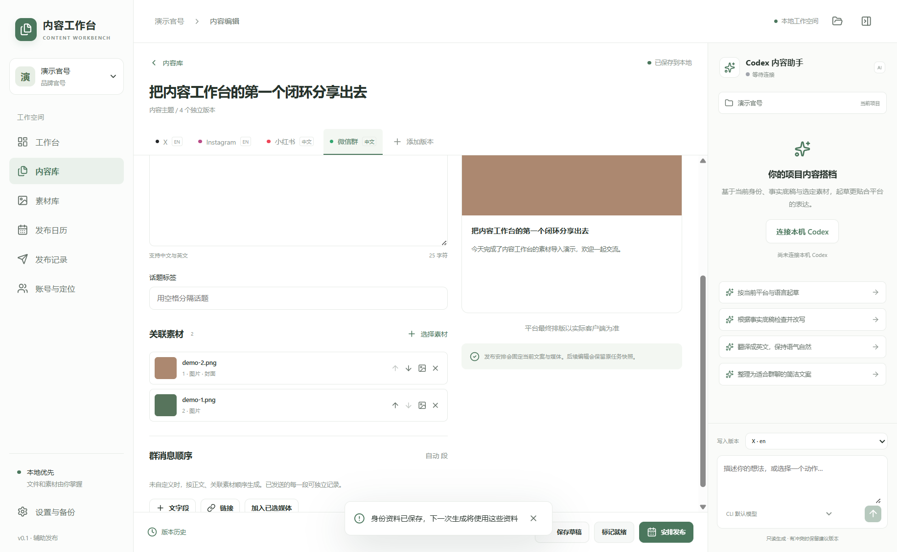
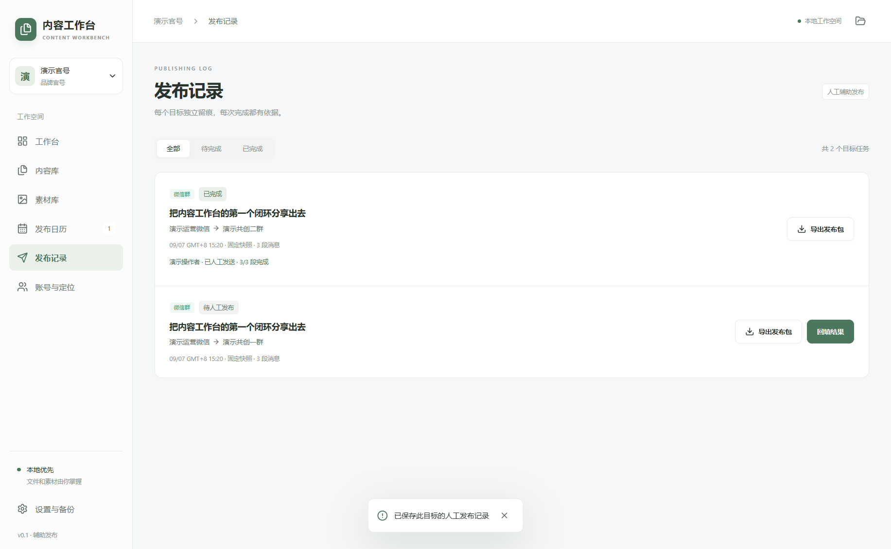

# 实现与验证记录

记录日期：2026-09-07。测试均使用隔离演示项目与自生成素材，没有向社交平台发帖。

## 0.1.1 图片预览更新

图片缓存、后台 Worker、重复索引优化、快速预览与原图切换已实现，内容库布局保持原样。新增验证后共 5 项业务、8 项集成、2 项图片缓存、3 条真实桌面测试通过。0.1.1 的安装版、便携版及已解压应用已构建，打包与便携启动检查都实际生成了缩略图，确认 Sharp 原生依赖可用。详见 [图片优化记录](image-performance.md)。

自动化测试使用自生成素材；额外的性能核对只在本机读取用户指定项目的图片，不修改原图，不提交业务图片或截图。以下其余条目保留首个闭环 0.1.0 的验收记录。

## 已通过

- TypeScript 静态检查和 ESLint。
- 业务测试：Range 正常 / 非法边界、2GB 以上偏移、目录穿越 / junction、JSONL 半行 / 多行 / UTF-8 分片和未知事件、无效 schema / CLI 路径。
- 文件 / SQLite 集成：两个项目隔离，重复素材复用，独立草稿，三段群消息，两个逐群任务，一个部分再完成、另一个未完成；导出不标记发送；修改草稿不影响快照；外部编辑保留双方并可合并；日志重启恢复；引用丢失 / 变化 / 重连；移动项目；备份恢复后暂停。
- 真实 Codex CLI 0.153.3：initialize、account/read、model/list 返回成功（7 个模型项）；演示官号两轮、演示创始人两轮生成都通过 outputSchema 校验并保存为新草稿。同一主题两轮复用同一 threadId，两个身份各自独立 threadId。官号输出使用“我们”，创始人使用“我”。
- Electron 44.2.0 官方 Windows x64 压缩包已通过 npm 包内 SHA-256 校验：`4021363e3090d67a144ebedb90765cf193b0e61f300c519c83f0174502a481da`。

## 桌面与构建验证

- Playwright 启动真实 Electron：导入并解码 PNG / JPEG / WebP；4 秒、640×360 的 H.264/AAC MP4 可播放，进度从播放起点推进，拖动到 2.5 秒成功；从当前帧生成新的 PNG 素材。
- 自定义媒体协议实测：Range 请求返回 206 与 32 字节；非法范围返回 416；不存在或跨项目素材 ID 返回 404。
- 真实桌面完整演练：官号导入媒体，保存身份，登记账号和两个群，建立 X 英文 / Instagram 英文 / 小红书中文 / 微信中文四版本，调整媒体顺序和封面，标记就绪、两个群独立排期、导出并回填其中一个；创始人另导入三张图和一个视频。退出重开后正文、媒体 ID 与顺序、逐群状态一致，渲染错误为 0。
- Windows NSIS 安装版和 portable 便携版已成功生成，文件各约 115 MB；构建未配置签名证书。
- 打包产物 `win-unpacked/Content Workbench.exe` 已实际启动，确认 `app.isPackaged=true`、Electron 44.2.0、Node 24.20.0、contextIsolation 开启、nodeIntegration 关闭，欢迎页可用。
- 2 GiB + 64 字节稀疏媒体夹具完成注册与哈希，读取超过 2 GiB 的指定区间返回正确 206、Content-Range 与 32 字节；最近一次本地验收的主进程 RSS 增长约 40 MiB，没有整文件载入。此测试验证大文件流，不冒称播放了 2 GiB 的真实长视频。
- 便携自解压程序在项目盘临时目录中启动，欢迎页与 preload IPC 均通过。当前机器系统盘空间不足以可靠完成自解压，推荐直接运行已解压应用，或安装时选择空间充足的磁盘。
- 共 5 项业务测试、7 项集成测试、2 条桌面测试通过。版本草稿与人工回填均为演示数据，未发生真实平台发送。
- 真实 Codex 总计 7 轮：两个身份各两轮微信草稿，加上带三张演示图片上下文的 X 英文、Instagram 英文、小红书中文草稿。跨进程恢复了官号主题 thread；所有提案正确保存，未知素材与并发编辑通过单独事件模拟校验。
- 实际 CLI 通知经过只保留协议字段、替换 thread / turn / item 标识的处理后保存为 `tests/fixtures/codex-events.jsonl`，按 11 字节分块重放通过。





## 可复现命令

```powershell
npm run typecheck
npm run lint
npm test
npm run test:integration
npm run test:e2e
npm run verify:codex # 显式联网生成，会使用当前 Codex 额度
npm run dist:win
```

验收夹具 `tests/fixtures/` 是纯色图片与 FFmpeg testsrc2 / sine 自生成四秒 H.264/AAC MP4。`verify:codex` 使用单独 `.local/codex-verification/` 项目，不修改全局 Codex 配置。三张演示截图与最小脱敏事件样本随文档提交；完整运行日志、应用用户数据、构建产物默认不提交仓库。GitHub Actions 只运行检查、构建和保存工作流附件，不自动发布 Release。

## 已知修复

- Node 22.18 在此 Windows 环境中用 `fs.cpSync` 导出中文路径发生原生进程退出；替换为逐文件校验复制后，全部集成测试通过。
- 外部正文改变后，更新历史和哈希，允许用户加载磁盘版本再合并。编辑器的保存基线固定在开始编辑的版本，不使用后台刷新后的新基线。
- 发布包通过临时目录完成后再改名，避免中断的半包被视作完整导出。备份显式包含原有目录结构里已登记的媒体。
# dev：平台管理、专用编辑界面与外观

2026-09-07：新增 / 编辑项目平台，内置微信公众号；新增七种编辑布局及预览；默认浅色，可手动切换深色或跟随系统。通过 `npm run dev` 验证启动与 Codex CLI 自动连接，本次未生成安装包。

验证包含类型检查、lint、5 项单元测试、10 项集成测试及 4 项桌面测试。新增覆盖平台重名和未知标识校验、只读项目、旧平台配置、改名后关联不变、AI 平台上下文、作者 / 摘要 / 原文链接导出、重启与备份恢复。桌面测试覆盖账号表单内新增和编辑平台、各平台界面差异、图文封面顺序与轮播、系统深色下默认浅色以及主题持久化。原有首个闭环、2 GiB 媒体范围读取、缩略图缓存测试保持通过。

测试只使用独立临时目录与合成素材；未发送平台内容。界面截图保存在忽略的 `.local/e2e-evidence/`。

## 2026-09-08 · V0.2 本地与模拟验收

新增发布状态机、四平台适配器和后台托盘，完成 7 项领域、13 项集成、23 项发布与适配器测试，以及 6 项 Electron 回归。V0.2 桌面图文模拟包含真实 safeStorage 加密、托盘与重启核对。没有社交平台外部发送，没有生成安装包。具体范围与证据见 [V0.2 验收](v0.2-progress.md)。
